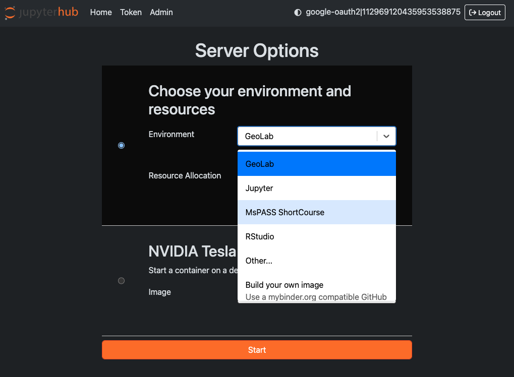
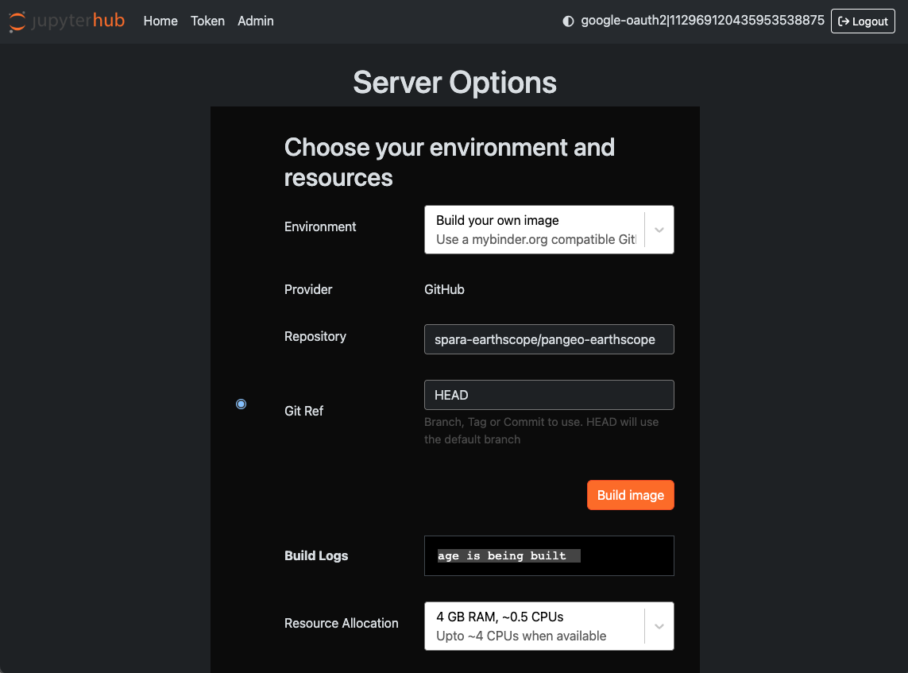
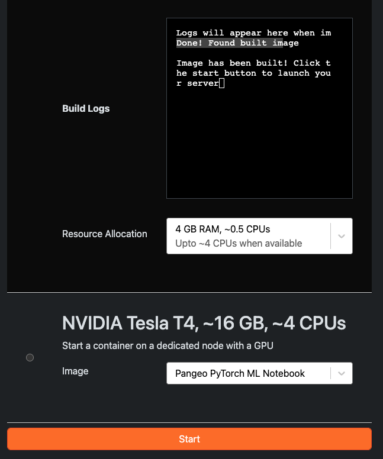
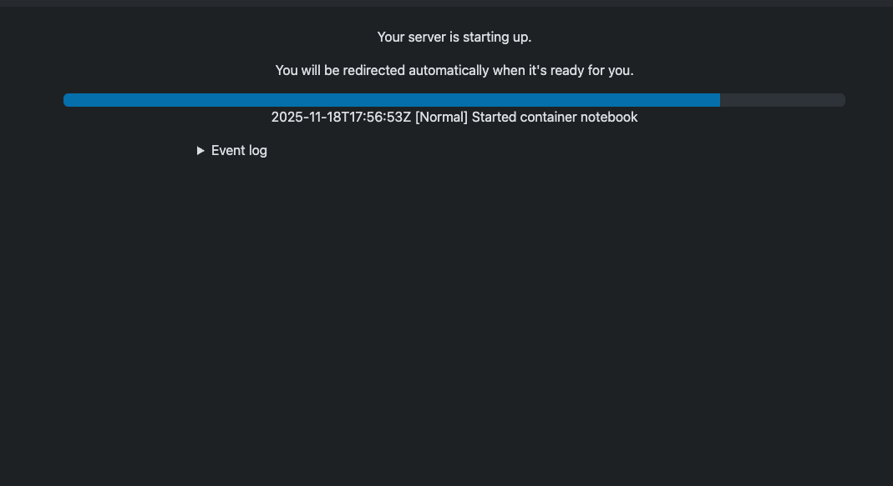
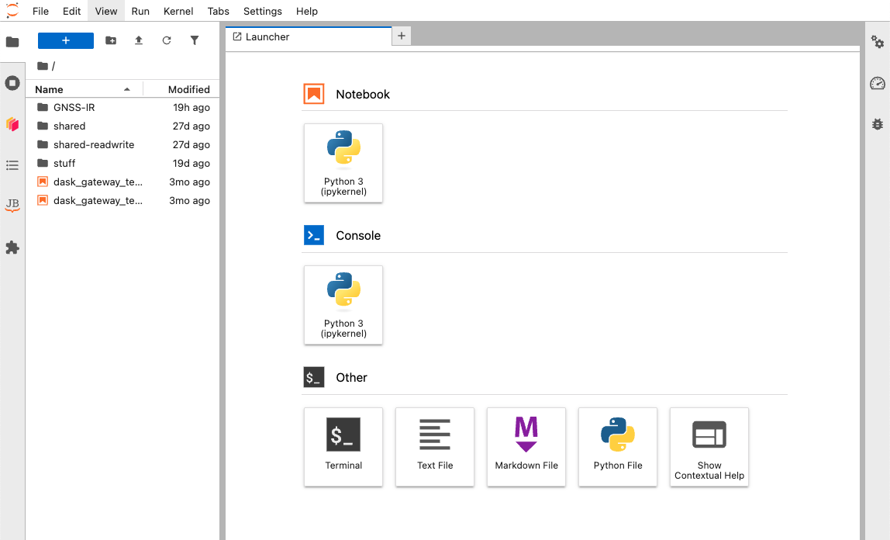

# EarthScope PanGeo Based Binder Example

This is an example repository for creating a custom binder instance using EarthScope's default GeoLab image.

## Making a copy of the repository

Install the latest Cookiecutter if you haven't installed it yet (this requires
Cookiecutter 1.4.0 or higher)::

```
pip install -U cookiecutter
```

Generate a Python package project::

```
cookiecutter https://github.com/spara-earthscope/pangeo_earthscope.git
```

Then:

* Create a repo and put it on GitHub.
* Add some more notebooks and configure your software environment.
* Use GeoLab to launch your repo.
* Share with the Pangeo Community

## Adding packages

Packages can be added with pip using the Dockerfile RUN command.

```dockerfile
RUN pip install -U scikit-learn
```

They can also be added using conda/mamba package manager with an `environment.yml` file.

```yaml
channels:
  - conda-forge

dependencies:
  # Packages required by ES
  - instaseis
  - pip
  - pip:
    - pyprop8
    - tdqm
```

## Adding files

Files can not be directly added to the `/home/jovyan` directory because it is mounted an instantiated at startup. A work around is to copy files to an existing directory, e.g., `/tmp`, create a new directory, e.g. `mkdir /tmp/notenbooks`.

## Running the binder

1. Open GeoLab
2. Under `Environment` select `Build your own image` from the dropdown.



3. Enter the name of the binder repository and select the `Build Image` button.



4. Select `Start` when the image has been built.



5. The start screen will display.



6. GeoLab is running.



## TODO

- properly format this repository as template


